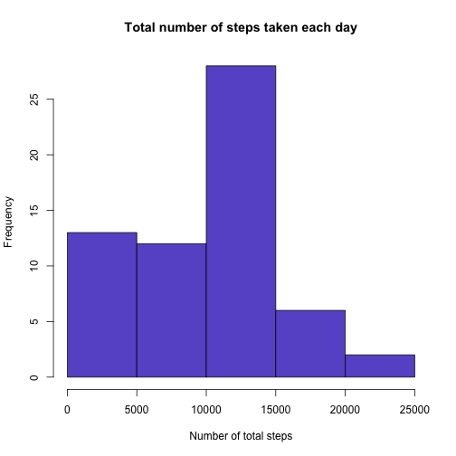

## Loading and preprocessing the data

```r
  library("data.table")
  if(!file.exists('activity.csv')){
    unzip('activity.zip')}
  df <- data.table::fread("~/Downloads/activity.csv")
```

## What is mean total number of steps taken per day?
### 1. The total number of steps taken per day

```r
  total_steps <- tapply(df$steps, df$date, FUN = sum, na.rm = TRUE)
```
### 2. Histogram of the total number of steps taken each day

```r
  hist(total_steps,col='slateblue3',xlab = "Number of total steps", main = "Total number of steps taken each day")
```


### 3. Mean and median of the total number of steps taken per day

```r
  meanSteps <- round(mean(total_steps),0)
  medianSteps <- median(total_steps)
```
Mean of total number of steps taken per day: **9354**
Median of total number of steps taken per day: **10395**

## What is the average daily activity pattern?
### 1. Time series plot of the 5-minute interval 

```r
  steps_by_interval <- aggregate(x=list(avgSteps=df$steps), by=list(interval=df$interval), FUN = mean, na.rm = TRUE)
  library(ggplot2)
  g1 <- ggplot(steps_by_interval,aes(x=interval,y=avgSteps)) + geom_line(color='slateblue3')
  print(g1)
```


### 2. The 5-minute interval contains maximum number of steps

```r
  maxSteps <- steps_by_interval[which.max(steps_by_interval$avgSteps),'avgSteps']
  interval_th <- steps_by_interval[which.max(steps_by_interval$avgSteps),'interval']
```
Across all the days in the dataset, the maximum number of steps is **206** and is found at the ***835*** 5-minute interval

## Imputing missing values
### 1. Total number of missing values

```r
  na_obs <- length(which(is.na(df$steps)))
```
There are **2304** missing values
### 2. Strategy for filling missing values

```r
  fill_value <- function(steps, interval) {
    filled <- NA
    if (!is.na(steps))
      filled <- c(steps)
    else
      filled <- (steps_by_interval[steps_by_interval$interval==interval, 'avgSteps'])
      return(filled)
    }
```
### 3. Imputing the missing values using the function created above

```r
  filled_df <- df
  filled_df$steps <- mapply(fill_value, filled_df$steps, filled_df$interval)
```
### 4. Histogram of the total number of steps taken each day (with imputed dataset)

```r
  total_steps2 <- tapply(filled_df$steps, filled_df$date, FUN = sum)
  hist(total_steps2,col='slateblue3',xlab = "Number of total steps", main = "Total number of steps taken each day (imputed data)")
```


```r
  meanSteps2 <- format(round(mean(total_steps2),0),scientific = FALSE)
  medianSteps2 <- format(round(median(total_steps2),0), scientific = FALSE)
```
The new Mean and Median are higher than previous Mean and Median: **10766** and **10766** vs **9354** and **10395** respectively. The previous mean and median are lower since the calculation was impacted by null values which were set to 0.

## Are there differences in activity patterns between weekdays and weekends?
### 1. Creating new factor variable classifying weekdays and weekends

```r
  day_of_week <- function(date) {
    dow <- weekdays(date)
    if (dow %in% c("Monday","Tuesday","Wednesday","Thursday","Friday"))
      return("weekday")
    else if (dow %in% c("Saturday","Sunday"))
      return("weekend")
    else
      stop("invalid date")
  }
filled_df$date <- as.Date(filled_df$date)
filled_df$dow <- sapply(filled_df$date, FUN = day_of_week)
```
### 2. Time series plot of the 5-minute interval split by weekdays and weekends

```r
  steps_by_dow <- aggregate(steps ~ interval + dow, data=filled_df, FUN=mean) 
  g2 <- ggplot(steps_by_dow, aes(interval,steps)) + geom_line(color = 'slateblue3') + facet_grid(dow ~ .)
  print(g2)
```


